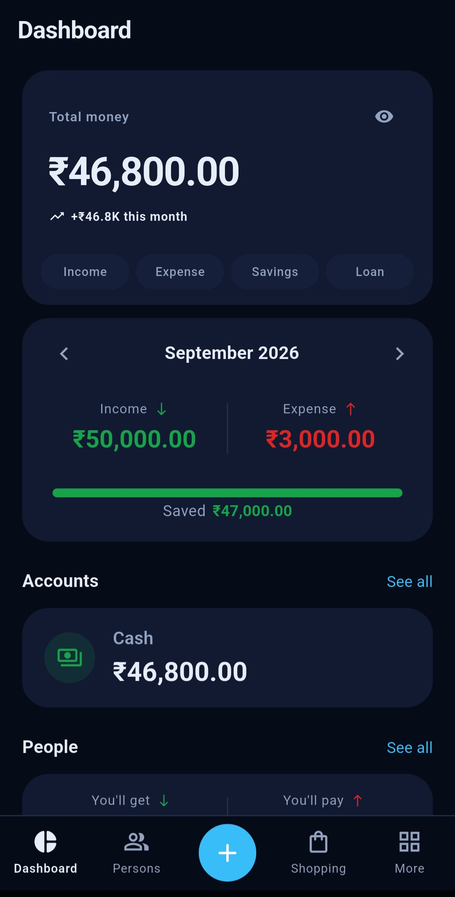
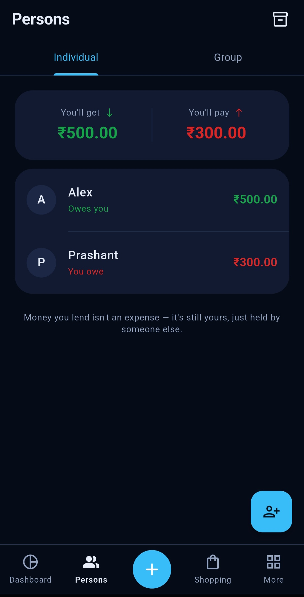
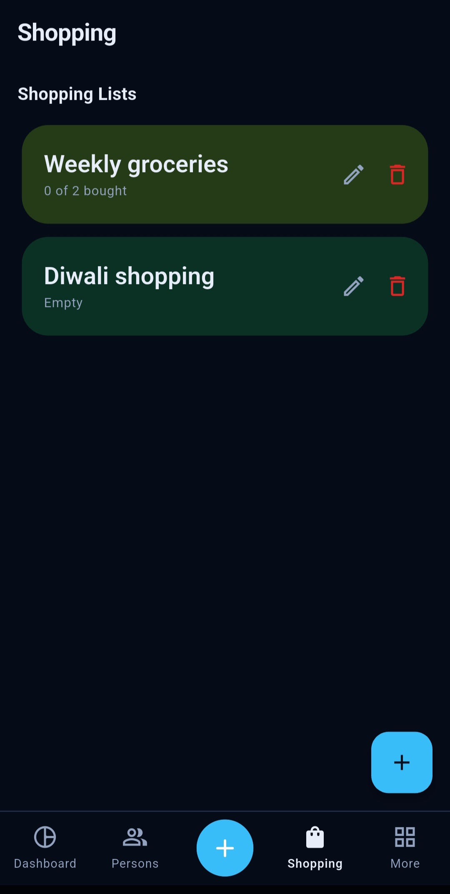
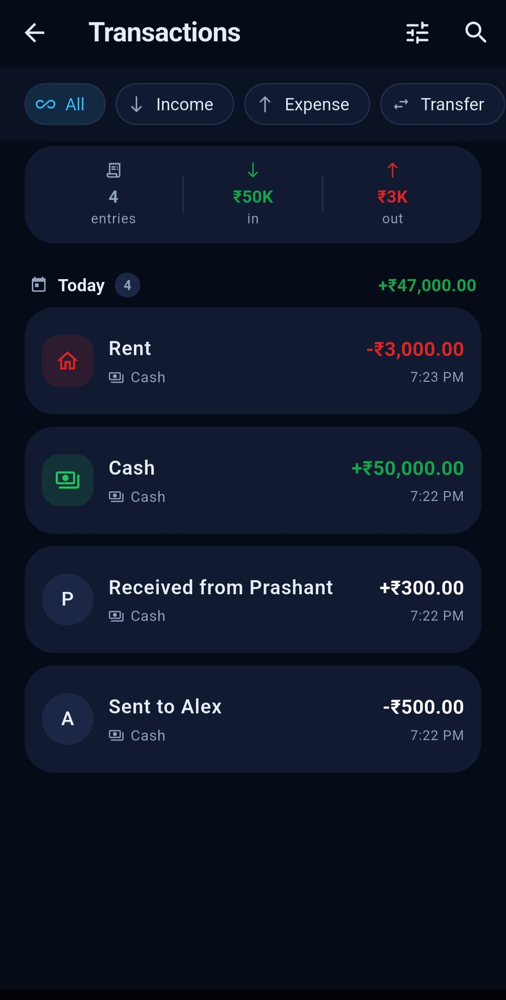

<div align="center">


<br><br>


[](https://f-droid.org/packages/com.codeshowoff.xpenc/)
[](https://github.com/CodeShowOff/XPENC/releases/latest)
[](https://github.com/CodeShowOff/XPENC/actions/workflows/ci.yml)
[](https://github.com/CodeShowOff/XPENC/actions/workflows/release.yml)
[](LICENSE)
[](https://flutter.dev)
[](https://github.com/CodeShowOff/XPENC/releases/latest)
[](https://github.com/CodeShowOff/XPENC/releases)
[](CONTRIBUTING.md)

**Offline-first personal finance for Android.**
Income, expenses, transfers, budgets and dues —
everything lives in a local SQLite database on your phone. Nothing is ever uploaded.

*Originally created by [Yash Patil](https://github.com/PATILYASHH/XPENC). Maintained and continued by CodeShowOff.*


<br><br>

<p align="center">
  
  
  
  
</p>

</div>

---

## Why it exists

Most expense apps quietly lie to you. They blur *where money sits* with *what it
was for*, count a transfer between your own accounts as income, or double-count
a UPI payment because the bank sent two SMS. XPENC treats the ledger as the
single source of truth and enforces one invariant everywhere:

> **Net worth = the sum of all account balances.** A transfer leaves it
> unchanged, income raises it, expense lowers it. If the numbers ever disobey
> that, it's a bug.

Amounts are integer **paise**, never doubles — floats corrupt money math.
Lending is not spending, and being repaid is not earning, so person movements
are excluded from budgets and income/expense reports.

📐 The complete design doc — mental model, data model, every decision and the
adversarial audit that hardened it — is in [structure.md](structure.md).

## Features

| | |
|---|---|
| 💳 **Honest accounts** | Cash / Bank / Card / Prepaid balance (fob, gift or transit card) with real balances. Debit cards & UPI are *linked instruments* — they spend their bank's money, so rupees are never counted twice. Credit cards carry their own (negative = owed) balance. |
| 🔁 **Income · Expense · Transfer** | Three transaction types, kept strictly apart. Transfers never pollute budgets or reports. |
| 🎯 **Budgets** | Per-category with period windows, live progress, once-per-period alerts at 80% and overspend, and a subcategory cap that can never exceed its parent's. |
| 📮 **Envelope Mode** | Opt-in per account: "every rupee has a job." Assign money from Ready to Assign into a category before you can spend it — a real value container, not just a ceiling. |
| 🏷️ **Tags & receipts** | Free-form tags beyond category, plus a photo receipt attached to any transaction — both one tap away in the app bar while adding a transaction. |
| 🐷 **Goals & Loans** | Save toward a target amount with running progress and a contribution history, or track money borrowed as a loan — in one hub. The most-funded goal sorts to the top. |
| 🛍️ **Shopping lists** | Named, colour-coded lists, not one flat list. |
| 🔒 **Passcode lock** | An optional PIN gate on app open, with biometric unlock (fingerprint/face) on top. |
| 📱 **Home screen widget** | Net worth at a glance on the Android home screen, live-updated with the ledger. |
| 📩 **Share it in — SMS or screenshot** | Share a bank SMS, or a Paytm/Google Pay/PhonePe payment screenshot, straight from your bank app. Read entirely on-device (no `READ_SMS` permission, no network call) and parsed into the Review Inbox — the same pipeline (dedupe · review cards · Auto-Approve with real Undo) either way. |
| 👥 **Persons — dues & loans** | They-owe / I-owe with running balances, partial settlements, optional real account movement, editable ledger entries. Group expenses split equally, by percentage or by manual amount across a group of Persons. Settle up with a Pay/Request button that opens UPI directly. |
| 📅 **Calendar & cash reminders** | Day-wise in/out grid; EMI/bill reminders that post *nothing* until you confirm. |
| 📊 **Insights** | Category pie, income vs expense, net-worth trend, per-account reports, and a downloadable Income & Expense PDF report — one chart engine, many views. |
| 💾 **Backup & export** | Symmetric JSON backup/restore + CSV shaped for accountants / Tally. Backups land in the public `Download/BACKUP XPENC` folder so they survive an uninstall, with an optional automatic schedule and retention. |
| 🎨 **Seven themes** | Material 3, One UI–inspired. True-black AMOLED dark, a violet "Colourful", a navy "Midnight", Cove — a One UI 9–inspired look with an ocean-blue accent and bigger, softer rounded cards — and Bold, a near-black theme with a coral-and-gold accent and Sora/Manrope typography. Font size, boldness and family are all separately adjustable app-wide. |
| ➕ **Customizable bottom nav** | Pick two of seven destinations for the nav bar's flexible slots; optionally hold the ➕ button to fan out three quick-access shortcuts instead of pushing Add Transaction. |

## Download


### Direct APK

Or grab it from [**Releases**](https://github.com/CodeShowOff/XPENC/releases/latest)
/ the [website](https://github.com/CodeShowOff/XPENC#download):

| Your phone | Asset |
|---|---|
| Most phones (~2017+) | [`xpenc-arm64-v8a.apk`](https://github.com/CodeShowOff/XPENC/releases/latest/download/xpenc-arm64-v8a.apk) |
| Older 32-bit phones | [`xpenc-armeabi-v7a.apk`](https://github.com/CodeShowOff/XPENC/releases/latest/download/xpenc-armeabi-v7a.apk) |
| Emulators | [`xpenc-x86_64.apk`](https://github.com/CodeShowOff/XPENC/releases/latest/download/xpenc-x86_64.apk) |

Every release ships `SHA256SUMS.txt` — verify your download. APKs are built,
tested and gated by [GitHub Actions](.github/workflows/release.yml); the
[release process](docs/RELEASING.md) is fully automated from a version tag.


## Privacy

Everything is stored on-device in the app's private SQLite database. Since
1.1.0 the app requests **no SMS permission at all** — the only runtime
permission is notifications. No transaction or balance ever leaves the phone.
**There is no server.**
Full policy: [PRIVACY.md](PRIVACY.md) · live at [https://github.com/CodeShowOff/XPENC/blob/main/PRIVACY.md](https://github.com/CodeShowOff/XPENC/blob/main/PRIVACY.md).
See [SECURITY.md](SECURITY.md) for the vulnerability disclosure policy.

## Tech stack

| Concern | Choice |
|---|---|
| Framework | Flutter 3.38.9 · Dart 3.10.8 |
| State | Riverpod |
| Database | Drift (SQLite), local-first, reactive queries |
| Routing | go_router |
| Charts | fl_chart |
| Notifications | flutter_local_notifications + timezone |

> ⚠️ Several packages are **deliberately pinned** (drift 2.31.0, riverpod 2.6.1, …).
> Do not bump them without reading the "Pinned dependencies" section of
> [CONTRIBUTING.md](CONTRIBUTING.md) — one of those bumps once shipped an APK
> that crashed on first open.

## Building from source

```sh
git clone https://github.com/CodeShowOff/XPENC.git
cd XPENC
flutter pub get
flutter run
```

### Tests

```sh
rm -rf build/native_assets   # Windows only: Flutter native-assets bug
flutter analyze
flutter test
```

The widget tests render every screen against a real in-memory database at a real
phone size (360 × 800 dp) and fail on a layout overflow, so they catch what
`flutter analyze` cannot. `test/branding_test.dart` additionally fails the build
if `AppInfo.version` ever drifts from the `version:` line in `pubspec.yaml`.

### Shipping an APK

```sh
flutter build apk --release --split-per-abi
bash tool/verify_apk.sh build/app/outputs/flutter-apk/app-arm64-v8a-release.apk
```

`verify_apk.sh` **must pass.** It is the only thing standing between you and
shipping an APK with no `libsqlite3.so` — a failure no unit test can see,
because every test overrides the database with an in-memory one.

### Code generation

Database classes are generated from `lib/data/tables.dart` by drift. After
changing a table:

```sh
dart run build_runner build --force-jit --delete-conflicting-outputs
```

**`--force-jit` is required** — without it build_runner fails with
`'dart compile' does not support build hooks` on this SDK. Schema-change
steps are in [CONTRIBUTING.md](CONTRIBUTING.md#changing-the-database-schema).

## Brand


Every asset — launcher icons, favicons, splash marks and website icons — is generated from the core logo design `assets/images/appicon.png`.

## Project structure

```
lib/
  core/          theme, Money type, branding, notifications
  data/          drift database, tables, DAOs, seed data
  domain/        entities, repository interfaces
  features/      one folder per screen (dashboard, transactions, budgets, …)
website/         landing page (Vercel)
tool/            icon generator, APK verification gate
.github/         CI + release workflows, issue & PR templates
docs/            releasing / maintainer docs
```

## Contributing

Contributions are very welcome — the highest-impact one is
[**adding an SMS template for your bank**](../../issues/new?template=bank_support.yml)
(config + regex, no app internals needed).

- 📖 [CONTRIBUTING.md](CONTRIBUTING.md) — setup, invariants, PR checklist
- 🤝 [CODE_OF_CONDUCT.md](CODE_OF_CONDUCT.md)
- 🔒 [SECURITY.md](SECURITY.md) — private vulnerability reporting
- 📦 [CHANGELOG.md](CHANGELOG.md) · [docs/RELEASING.md](docs/RELEASING.md) — SemVer, `v*` tags, automated releases


## Developer

**Yash Patil (Original Creator)** — GitHub [@PATILYASHH](https://github.com/PATILYASHH)

**CodeShowOff (Current Maintainer)** — GitHub [@CodeShowOff](https://github.com/CodeShowOff) · LinkedIn [in/CodeShowOff](https://www.linkedin.com/in/CodeShowOff/)

## License

[MIT](LICENSE) © 2026 Yash Patil & CodeShowOff

<div align="center">
<sub>If XPENC keeps your money honest, a ⭐ keeps the project alive.</sub>
</div>
